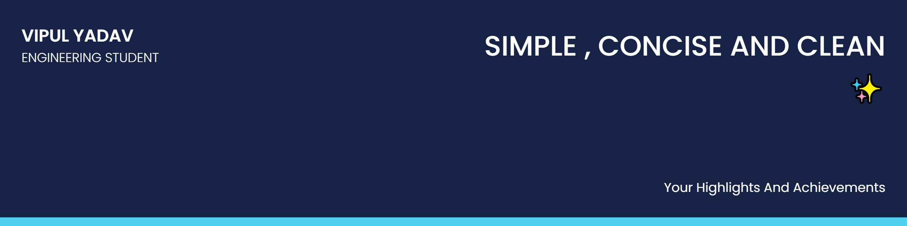

"# v-ipul" 

VIPUL YADAV

I am a ENTC engineering student from Vishwakarma Institute of Information Technology , Pune 

## 🧔 About Me

- 🔭 I’m currently working on my personal projects

- 🌱 I’m currently learning **Machine Learning **

- 👯 I’m looking to collaborate on **Data analytics Projects**

- 📫 Contact me **[here](vipulyadav21124@gmail.com)**

## 📚 My Skills

[]

## 🤝 Connect

